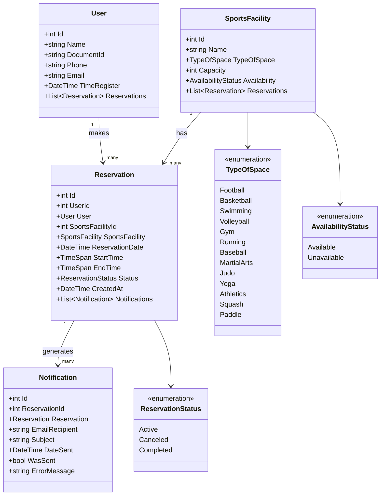
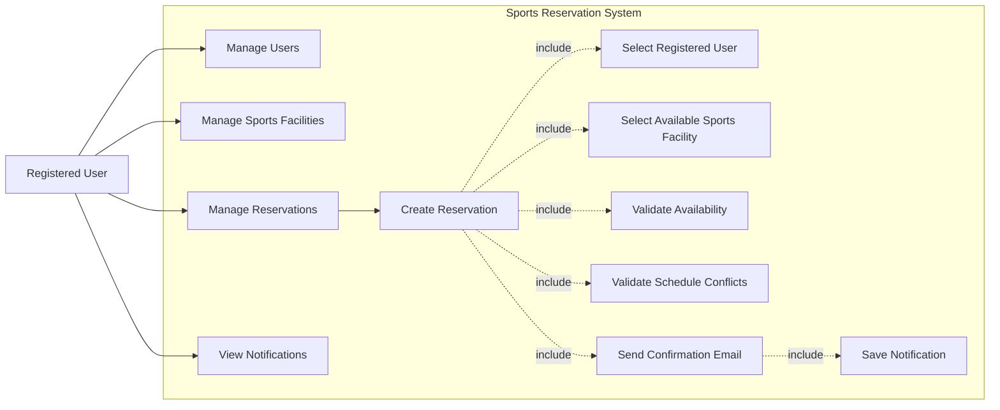

# Sports Reservation System

Sistema web desarrollado en ASP.NET Core MVC para gestionar usuarios, espacios deportivos, reservas y notificaciones por correo electrónico.

El sistema permite registrar usuarios, crear espacios deportivos, realizar reservas, validar cruces de horarios y enviar una notificación por correo cuando una reserva se crea correctamente.

---

## Tecnologías utilizadas

- ASP.NET Core MVC
- C#
- Entity Framework Core
- MySQL
- Pomelo.EntityFrameworkCore.MySql
- Bootstrap
- Bootstrap Icons
- SMTP Gmail

---

## Requisitos previos

Antes de ejecutar el proyecto, asegúrate de tener instalado:

- .NET SDK
- MySQL Server
- Visual Studio Code o Visual Studio
- Navegador web
- Una cuenta de Gmail si deseas probar el envío de correos

Puedes verificar si .NET está instalado ejecutando:

```bash
dotnet --version
```

---

## Estructura principal del proyecto

```text
PruebaCsharp/
│
├── Controllers/
│   ├── HomeController.cs
│   ├── UsersController.cs
│   ├── SportsFacilitiesController.cs
│   ├── ReservationsController.cs
│   └── NotificationsController.cs
│
├── Data/
│   └── ApplicationDbContext.cs
│
├── Enums/
│   ├── TypeOfSpace.cs
│   ├── AvailabilityStatus.cs
│   └── ReservationStatus.cs
│
├── Models/
│   ├── User.cs
│   ├── SportsFacility.cs
│   ├── Reservation.cs
│   ├── Notification.cs
│   └── ErrorViewModel.cs
│
├── Services/
│   ├── UserService.cs
│   ├── SportsFacilityService.cs
│   ├── ReservationService.cs
│   └── EmailService.cs
│
├── ViewModels/
│   └── ReservationCreateViewModel.cs
│
├── Views/
│   ├── Home/
│   ├── Users/
│   ├── SportsFacilities/
│   ├── Reservations/
│   ├── Notifications/
│   └── Shared/
│
├── wwwroot/
│   ├── css/
│   ├── js/
│   └── lib/
│
├── appsettings.json
├── Program.cs
└── README.md
```

---

## Configuración de la base de datos

El proyecto usa MySQL.

Primero crea una base de datos en MySQL con el siguiente nombre:

```sql
CREATE DATABASE sports_Jaramc_db;
```

Luego revisa el archivo:

```text
appsettings.json
```

Debe tener una cadena de conexión como esta:

```json
{
  "ConnectionStrings": {
    "DefaultConnection": "Server=localhost;Port=3306;Database=sports_Jaramc_db;User=root;Password=123456;"
  }
}
```

Modifica los valores según tu configuración local:

```text
Server: servidor de MySQL
Port: puerto de MySQL
Database: nombre de la base de datos
User: usuario de MySQL
Password: contraseña de MySQL
```

Ejemplo:

```json
"DefaultConnection": "Server=localhost;Port=3306;Database=sports_Jaramc_db;User=root;Password=tu_password;"
```

---

## Configuración SMTP para envío de correos

El sistema envía un correo de confirmación cuando se crea una reserva.

En el archivo:

```text
appsettings.json
```

agrega o revisa esta sección:

```json
"SmtpSettings": {
  "Host": "smtp.gmail.com",
  "Port": "587",
  "SenderEmail": "your-email@gmail.com",
  "SenderPassword": "your-app-password",
  "EnableSsl": "true"
}
```

Para Gmail, estos valores se mantienen:

```json
"Host": "smtp.gmail.com",
"Port": "587",
"EnableSsl": "true"
```

Debes cambiar:

```json
"SenderEmail": "your-email@gmail.com",
"SenderPassword": "your-app-password"
```

por los datos reales de la cuenta que enviará los correos.

Importante:

No uses la contraseña normal de Gmail. Debes usar una contraseña de aplicación generada desde tu cuenta de Google.

Para crear una contraseña de aplicación:

1. Entra a tu cuenta de Google.
2. Ve a Seguridad.
3. Activa la verificación en dos pasos.
4. Busca Contraseñas de aplicaciones.
5. Crea una contraseña para la aplicación.
6. Copia la clave generada.
7. Pega esa clave en `SenderPassword`.

Ejemplo:

```json
"SmtpSettings": {
  "Host": "smtp.gmail.com",
  "Port": "587",
  "SenderEmail": "sportsreservation@gmail.com",
  "SenderPassword": "abcdefghijklmnop",
  "EnableSsl": "true"
}
```

No subas contraseñas reales a GitHub.

---

## Instalación de paquetes

Desde la terminal, dentro de la carpeta del proyecto, instala los paquetes necesarios:

```bash
dotnet add package Pomelo.EntityFrameworkCore.MySql
dotnet add package Microsoft.EntityFrameworkCore.Design
dotnet add package Microsoft.EntityFrameworkCore.Tools
```

Luego ejecuta:

```bash
dotnet restore
```

---

## Migraciones de Entity Framework Core

Si el proyecto aún no tiene migraciones creadas, ejecuta:

```bash
dotnet ef migrations add InitialCreate
```

Luego actualiza la base de datos:

```bash
dotnet ef database update
```

Esto creará las tablas principales:

```text
Users
SportsFacilities
Reservations
Notifications
```

---

## Ejecutar el proyecto

Para compilar el proyecto:

```bash
dotnet build
```

Para ejecutarlo:

```bash
dotnet run
```

Luego abre en el navegador la URL que indique la terminal.

Ejemplo:

```text
http://localhost:5049
```

Si aparece un error indicando que el puerto está ocupado:

```text
address already in use
```

puedes cerrar el proceso anterior con:

```bash
lsof -i :5049
kill -9 PID
```

Reemplaza `PID` por el número del proceso que aparezca en la terminal.

También puedes ejecutar el proyecto en otro puerto:

```bash
dotnet run --urls "http://localhost:5055"
```

Y entrar a:

```text
http://localhost:5055
```

---

## Módulos del sistema

### Users

Permite gestionar usuarios registrados.

Campos principales:

```text
Name
DocumentId
Phone
Email
TimeRegister
```

Validaciones:

- El nombre es obligatorio.
- El nombre solo permite letras y espacios.
- El documento es obligatorio.
- El documento solo permite números.
- El documento no se puede repetir.
- El teléfono es obligatorio.
- El teléfono solo permite números.
- El correo es obligatorio.
- El correo debe tener formato válido.
- El correo no se puede repetir.

---

### Sports Facilities

Permite gestionar espacios deportivos.

Campos principales:

```text
Name
TypeOfSpace
Capacity
Availability
```

Tipos de espacio disponibles:

```text
Football
Basketball
Swimming
Volleyball
Gym
Running
Baseball
MartialArts
Judo
Yoga
Athletics
Squash
Paddle
```

Validaciones:

- El nombre es obligatorio.
- El nombre debe iniciar con una letra.
- El nombre solo puede contener letras, números y espacios.
- La capacidad debe ser mayor que cero.
- No se puede repetir la combinación `Name + TypeOfSpace`.
- La disponibilidad puede ser `Available` o `Unavailable`.

---

### Reservations

Permite crear y administrar reservas.

Campos principales:

```text
UserId
SportsFacilityId
ReservationDate
StartTime
EndTime
Status
CreatedAt
```

Estados de reserva:

```text
Active
Canceled
Completed
```

Validaciones importantes:

- El usuario seleccionado debe existir.
- El espacio deportivo seleccionado debe existir.
- El espacio debe estar disponible.
- No se permiten fechas pasadas.
- Si la reserva es para hoy, la hora de inicio no puede haber pasado.
- La hora final debe ser mayor que la hora inicial.
- No se permiten cruces de horario para el mismo espacio deportivo.
- No se permiten cruces de horario para el mismo usuario.
- Solo las reservas activas pueden ser canceladas.
- Solo las reservas activas pueden ser completadas.

---

### Notifications

Permite revisar el resultado del envío de correos.

Campos principales:

```text
ReservationId
EmailRecipient
Subject
DateSent
WasSent
ErrorMessage
```

Cuando se crea una reserva correctamente:

1. Se guarda la reserva.
2. El sistema intenta enviar un correo al usuario seleccionado.
3. Se crea un registro en `Notifications`.
4. Si el correo se envía correctamente, `WasSent` queda en `true`.
5. Si el correo falla, `WasSent` queda en `false` y se guarda el error en `ErrorMessage`.

---

## Flujo general del sistema

```text
1. Crear usuarios.
2. Crear espacios deportivos.
3. Crear reservas seleccionando usuario y espacio deportivo.
4. El sistema valida disponibilidad y cruces de horario.
5. Si la reserva es válida, se guarda.
6. El sistema envía correo de confirmación.
7. El sistema registra la notificación.
8. El usuario puede revisar reservas y notificaciones desde la aplicación.
```

---

## Diagramas

### Diagrama de clases



### Diagrama de casos de uso



---

## Pruebas recomendadas

### Usuarios

Probar:

```text
Crear usuario válido.
Crear usuario con documento repetido.
Crear usuario con correo repetido.
Crear usuario con nombre que tenga números.
Crear usuario con correo inválido.
```

### Espacios deportivos

Probar:

```text
Crear Court 1 - Football - 10 - Available.
Crear otra vez Court 1 - Football.
Crear Court 1 - Basketball.
Crear espacio con capacidad 0.
Crear espacio con nombre 12345.
Crear espacio con nombre Court @@@.
```

### Reservas

Probar:

```text
Crear una reserva válida.
Crear una reserva sin seleccionar usuario.
Crear una reserva sin seleccionar espacio.
Crear reserva en fecha pasada.
Crear reserva con hora final menor que hora inicial.
Crear dos reservas cruzadas para el mismo espacio.
Crear dos reservas cruzadas para el mismo usuario.
Cancelar una reserva activa.
Completar una reserva activa.
```

### Notificaciones

Probar:

```text
Crear una reserva válida.
Revisar si se creó un registro en Notifications.
Verificar si WasSent quedó en true o false.
Si WasSent es false, revisar ErrorMessage.
```

---

## Consultas útiles en MySQL

Ver usuarios:

```sql
SELECT * FROM Users;
```

Ver espacios deportivos:

```sql
SELECT * FROM SportsFacilities;
```

Ver reservas:

```sql
SELECT * FROM Reservations;
```

Ver notificaciones:

```sql
SELECT * FROM Notifications;
```

Ver reservas con usuario y espacio:

```sql
SELECT 
    r.Id,
    u.Name AS UserName,
    u.Email,
    s.Name AS SportsFacility,
    s.TypeOfSpace,
    r.ReservationDate,
    r.StartTime,
    r.EndTime,
    r.Status
FROM Reservations r
INNER JOIN Users u ON r.UserId = u.Id
INNER JOIN SportsFacilities s ON r.SportsFacilityId = s.Id;
```

---

## Problemas comunes

### El puerto está ocupado

Error:

```text
address already in use
```

Solución:

```bash
lsof -i :5049
kill -9 PID
```

O ejecutar en otro puerto:

```bash
dotnet run --urls "http://localhost:5055"
```

---

### No se envía el correo

Revisa:

```text
SenderEmail
SenderPassword
Host
Port
EnableSsl
```

También revisa que estés usando una contraseña de aplicación de Gmail, no la contraseña normal.

Luego revisa en la tabla `Notifications`:

```sql
SELECT * FROM Notifications;
```

Si `WasSent` es `false`, revisa `ErrorMessage`.

---

### No aparecen espacios deportivos al crear reserva

Verifica que existan espacios deportivos con disponibilidad:

```text
Available
```

El formulario de reservas solo muestra espacios disponibles.

---

### Error al crear una reserva cruzada

Esto es correcto. El sistema no permite dos reservas activas en el mismo horario para el mismo espacio o para el mismo usuario.

---

## Seguridad

No se recomienda subir contraseñas reales a GitHub.

Si vas a subir el proyecto, cambia esta sección:

```json
"SenderEmail": "your-email@gmail.com",
"SenderPassword": "your-app-password"
```

y documenta que cada usuario debe configurar sus propios datos SMTP.

## Repositorio : https://github.com/Jaramc/PruebaCsharp